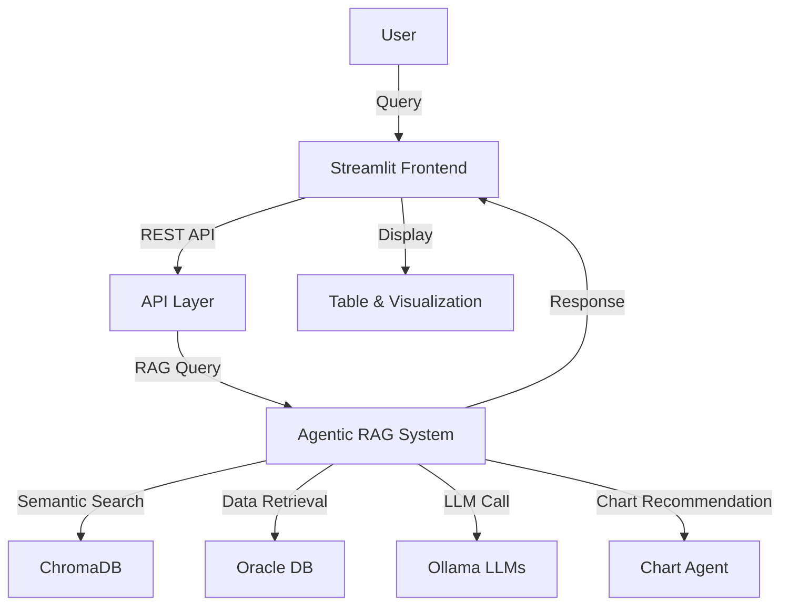
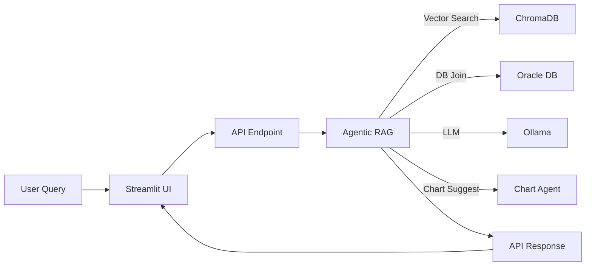
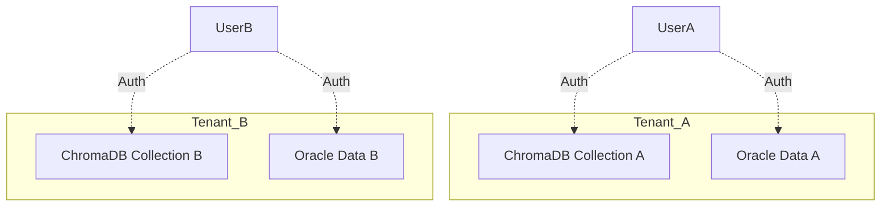

# Agentic Assistant – Technical Documentation

---

## Title Page

**Project:** Agentic Assistant  
**Version:** 1.0  
**Company:** RecVue  
**Date:** 06/15/25

---

## Table of Contents

1. [System Overview](#system-overview)
2. [Architecture Diagrams](#architecture-diagrams)
3. [Component Descriptions](#component-descriptions)
    - [Streamlit Frontend](#streamlit-frontend)
    - [API Layer](#api-layer)
    - [Agentic RAG System](#agentic-rag-system)
    - [LLM Integration](#llm-integration)
    - [Oracle DB](#oracle-db)
    - [ChromaDB](#chromadb)
    - [Multi-Tenancy](#multi-tenancy)
    - [Visualization](#visualization)
4. [Data & API Flow](#data--api-flow)
5. [Setup Instructions](#setup-instructions)
6. [Usage Guide](#usage-guide)
7. [Error Handling & Robustness](#error-handling--robustness)
8. [Extensibility & Organization](#extensibility--organization)
9. [Operational Notes](#operational-notes)
10. [Troubleshooting](#troubleshooting)
11. [References](#references)
12. [Change Log](#change-log)

---

## System Overview

Agentic Assistant is an enterprise-grade, agentic Retrieval-Augmented Generation (RAG) platform for intelligent data search, analytics, and visualization. It combines:
- A modern Streamlit frontend for user interaction and analytics
- A robust Python backend with agentic LLM orchestration
- Deep integration with Oracle DB (system of record)
- ChromaDB for vector-based semantic search and multi-tenancy
- Dynamic charting and insights powered by LLMs and business logic

**Key Use Cases:**
- Natural language search and analytics over enterprise data
- Multi-tenant SaaS deployments with strict data isolation
- Automated insights, chart recommendations, and business context

---

## Architecture Diagrams

### High-Level System Architecture


### Data Flow (Per Query)


### Multi-Tenancy Isolation


---

## Component Descriptions

### Streamlit Frontend
- Modern UI for query input, result display, and analytics
- Always displays a data table for tabular results
- Renders the most appropriate chart type based on backend recommendations
- Allows tenant switching (multi-tenant SaaS)

### API Layer
- RESTful endpoints for search, insert, and refresh
- Handles authentication and tenant isolation (see `auth/tenant_auth.py`)
- Forwards user queries to the agentic backend
- Returns structured results, tables, and chart metadata

### Agentic RAG System (`rag_agent.py`)
- Orchestrates data retrieval, semantic search, LLM response generation, and chart recommendation
- Uses an agentic approach (AutoGen or direct orchestration) for modular, extensible logic
- Handles model selection and fallback for LLMs
- Integrates with ChromaDB for semantic retrieval and Oracle DB for ground-truth data
- Generates both natural language answers and visualization instructions

### LLM Integration
- Utilizes Ollama to run local LLMs (Llama 3:8b preferred, with fallbacks to smaller models)
- Automatically selects the best model based on available system resources
- Configured for high performance (large context, multi-threading, long responses)
- LLMs are used for:
  - Interpreting user queries
  - Generating natural language responses
  - Recommending chart types and columns
  - Providing business context and insights

### Oracle DB
- Serves as the system of record for all transactional data (orders, billing, delivery, pricing, etc.)
- Schema includes tables like `ORDER_HEADER_ALL`, `ORDER_LINES_ALL`, `BILLING_SCHEDULES_ALL`, `ORDER_DELIVERIES_ALL`, `PRICING_SCHEDULES_ALL`, and `change_log`
- Data is extracted and joined for embedding and analytics
- Change tracking via `change_log` enables efficient delta refresh
- Multi-tenant data partitioning supported via tenant_id columns

### ChromaDB
- Vector database for semantic search and retrieval
- Stores embeddings generated from Oracle data
- Each tenant has a separate ChromaDB collection for strict data isolation
- Used for fast, context-aware search and ranking
- Persistent storage in `chroma_storage/`

### Multi-Tenancy
- Each tenant’s data is isolated at both the Oracle DB and ChromaDB layers
- API and backend enforce tenant context on every operation
- Tenant switching supported in the UI
- Auth middleware (`auth/tenant_auth.py`) ensures only authorized access
- Embeddings, search, and analytics are always tenant-scoped

### Visualization
- Uses pandas and Plotly for dynamic charting
- Chart type and columns are recommended by the backend agent based on query and data
- Always displays a data table if possible, even if LLM fails
- Supports bar, line, pie, and other chart types

---

## Data & API Flow

### End-to-End Query Flow
1. **User submits a query** via Streamlit UI
2. **API Layer** receives the request, authenticates, and determines tenant context
3. **Agentic RAG System**:
   - Interprets the query (LLM)
   - Retrieves relevant records (ChromaDB vector search)
   - Joins with Oracle DB for full data
   - Generates a natural language answer (LLM)
   - Recommends a chart type and columns (LLM/logic)
4. **API Layer** returns structured data, answer, and chart metadata
5. **Frontend** displays the table and renders the recommended chart

### API Endpoints (Sample)
- `POST /api/tenant/<tenant_id>/orders` — Insert new order for a tenant
- `GET /api/tenant/<tenant_id>/search` — Semantic search for a tenant
- `POST /api/tenant/<tenant_id>/refresh` — Trigger delta refresh for a tenant
- `POST /api/ai/query` — RAG agent query endpoint (natural language)

---

## Setup Instructions

1. **Install Python dependencies:**
   ```bash
   pip install -r requirements.txt
   ```
2. **Install and start Ollama:**
   - Download and install Ollama from [https://ollama.com/](https://ollama.com/)
   - Pull the required models (e.g., Llama 3:8b):
     ```bash
     ollama pull llama3:8b
     ```
   - Start the Ollama service.
3. **Configure Oracle DB:**
   - Update connection details in `config/db_config.py`
   - Ensure schema is created (see `database/schema.sql`)
4. **Backfill and embed data:**
   ```bash
   python backfill_orders.py
   ```
5. **Run the API server:**
   ```bash
   python api/app.py
   ```
6. **Launch the Streamlit app:**
   ```bash
   streamlit run streamlit_app.py
   ```

---

## Usage Guide

- Open the Streamlit app in your browser
- Select or switch tenant as needed
- Enter a query in the input box
- The app will display:
  - A data table (if data is available)
  - A recommended chart (bar, line, pie, etc.) based on the query and data
- If the LLM is unavailable or fails, the app will still attempt to display a table and sensible default chart
- Use the API endpoints for programmatic access or integration

---

## Error Handling & Robustness

- Type checks and parsing are implemented to handle string/dict mismatches between LLM output and expected formats
- The system gracefully handles context token limit errors by switching to smaller models or truncating input
- Exception handling is in place for common Python errors (e.g., AttributeError), following best practices ([Rollbar](https://rollbar.com/blog/python-attributeerror/), [GeeksforGeeks](https://www.geeksforgeeks.org/python/python-attributeerror/))
- Oracle DB can be stopped to free up RAM for LLMs if not needed
- Multi-tenancy enforced at every layer for security and data isolation

---

## Extensibility & Organization

- **Adding new tenants:**
  - Create new Oracle DB partitions/rows and ChromaDB collections
  - Update tenant config and auth as needed
- **Adding new data sources:**
  - Extend the data extraction and embedding pipeline
  - Update schema and ETL scripts
- **Adding new LLMs or models:**
  - Add to the fallback list in the agentic backend
  - Update model selection logic
- **API extensibility:**
  - Add new endpoints for additional business logic or analytics
- **Modular codebase:**
  - Clear separation of concerns (data, embeddings, API, UI, auth)
  - Easy to onboard new developers

---

## Operational Notes

- **Deployment:**
  - Can be run locally or containerized for cloud deployment
  - Ensure Oracle DB and ChromaDB are accessible to backend
- **Scaling:**
  - Multi-tenant architecture supports SaaS scaling
  - ChromaDB and Oracle can be horizontally scaled
- **Monitoring:**
  - Add logging and monitoring for API, LLM, and DB health
- **Security:**
  - Tenant isolation, API authentication, and least-privilege DB access
- **Backups:**
  - Regularly backup Oracle DB and ChromaDB storage

---

## Troubleshooting

- **AttributeError:** Ensure correct object types and attribute names; use try/except for robustness ([see details](https://rollbar.com/blog/python-attributeerror/), [GeeksforGeeks guide](https://www.geeksforgeeks.org/python/python-attributeerror/))
- **Out of Memory:** Use smaller LLM models or stop unnecessary services (like Oracle DB)
- **Chart Not Displayed:** Check if the data returned is suitable for visualization; fallback to table-only display if not
- **API Errors:** Check logs for stack traces and error messages
- **Tenant Data Issues:** Ensure correct tenant context is passed in every API call

---

## References

- [Rollbar: How to Fix AttributeError in Python](https://rollbar.com/blog/python-attributeerror/)
- [GeeksforGeeks: Python AttributeError](https://www.geeksforgeeks.org/python/python-attributeerror/)
- [Technical Documentation Template Tips](https://www.technical-documentation-template.com/index.html)
- [RAG Agent Integration Guide](./README_RAG_INTEGRATION.md)
- [RAG Agent POC](./RAG_AGENT_README.md)

---

## Change Log

- **v1.1** – Rebranded as Agentic Assistant, expanded documentation, added diagrams, and deepened technical content (06/15/25)
- **v1.0** – Initial professional documentation as Global Search POC 