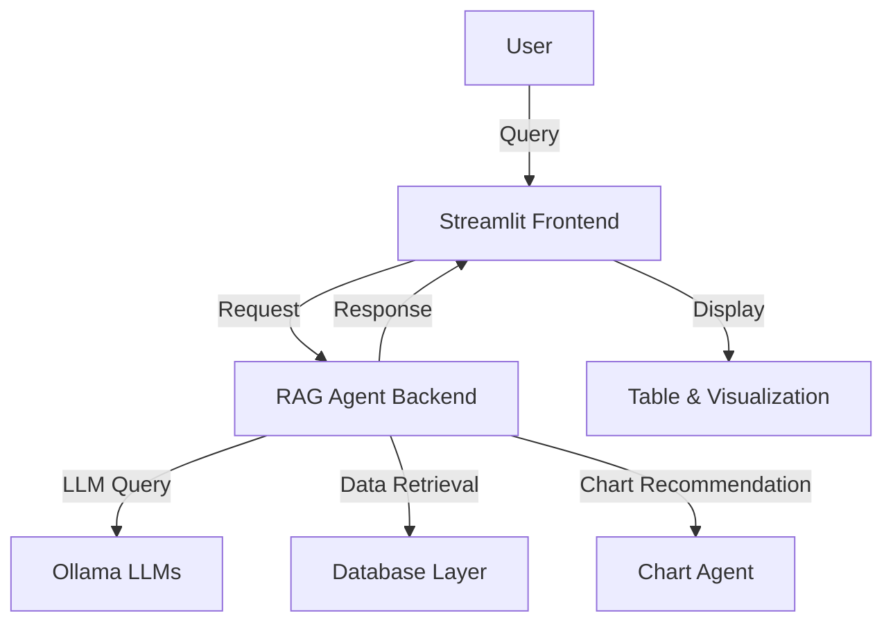

# Global Search POC – Technical Documentation

---

## Title Page

**Project:** Global Search POC  
**Version:** 1.0  
**Authors:** [Your Team/Company Name]  
**Date:** [Insert Date]

---

## Table of Contents

1. [System Overview](#system-overview)
2. [Architecture Diagram](#architecture-diagram)
3. [Component Descriptions](#component-descriptions)
    - [Streamlit Frontend](#streamlit-frontend)
    - [RAG Agent Backend](#rag-agent-backend)
    - [LLM Integration](#llm-integration)
    - [Database Layer](#database-layer)
    - [Visualization](#visualization)
4. [Setup Instructions](#setup-instructions)
5. [Usage Guide](#usage-guide)
6. [Error Handling & Robustness](#error-handling--robustness)
7. [Extensibility](#extensibility)
8. [Troubleshooting](#troubleshooting)
9. [References](#references)
10. [Change Log](#change-log)

---

## System Overview

The Global Search POC is an enterprise-grade Retrieval-Augmented Generation (RAG) system for data search and visualization. It features a Streamlit-based frontend, a Python backend with agentic LLM orchestration, and dynamic charting. The system is designed for flexibility, performance, and extensibility, supporting multiple LLMs and automatic chart recommendations.

---

## Architecture Diagram



---

## Component Descriptions

### Streamlit Frontend
- Provides a user interface for query input, result display, and data visualization.
- Always displays a data table for tabular results.
- Renders the most appropriate chart type based on backend recommendations.

### RAG Agent Backend (`rag_agent.py`)
- Orchestrates data retrieval, LLM response generation, and chart recommendation.
- Uses an agentic approach (AutoGen) for modular, extensible logic.
- Handles model selection and fallback.

### LLM Integration
- Utilizes Ollama to run local LLMs (Llama 3:8b preferred, with fallbacks to smaller models).
- Automatically selects the best model based on available system resources.
- Configured for high performance (large context, multi-threading, long responses).

### Database Layer
- Supports Oracle and other databases for enterprise data retrieval.
- Can be disabled to free up RAM if not needed for live queries.

### Visualization
- Uses pandas and Plotly for dynamic charting.
- Chart type and columns are recommended by the backend agent based on query and data.

---

## Setup Instructions

1. **Install Python dependencies:**
   ```bash
   pip install -r requirements.txt
   ```
2. **Install and start Ollama:**
   - Download and install Ollama from [https://ollama.com/](https://ollama.com/)
   - Pull the required models (e.g., Llama 3:8b):
     ```bash
     ollama pull llama3:8b
     ```
   - Start the Ollama service.
3. **(Optional) Start Oracle DB** if live database queries are required.
4. **Run the Streamlit app:**
   ```bash
   streamlit run streamlit_app.py
   ```

---

## Usage Guide

- Open the Streamlit app in your browser.
- Enter a query in the input box.
- The app will display:
  - A data table (if data is available).
  - A recommended chart (bar, line, pie, etc.) based on the query and data.
- If the LLM is unavailable or fails, the app will still attempt to display a table and sensible default chart.

---

## Error Handling & Robustness

- Type checks and parsing are implemented to handle string/dict mismatches between LLM output and expected formats.
- The system gracefully handles context token limit errors by switching to smaller models or truncating input.
- Exception handling is in place for common Python errors (e.g., AttributeError), following best practices ([Rollbar](https://rollbar.com/blog/python-attributeerror/), [GeeksforGeeks](https://www.geeksforgeeks.org/python/python-attributeerror/)).
- Oracle DB can be stopped to free up RAM for LLMs if not needed.

---

## Extensibility

- The chart recommendation agent can be extended to support more chart types or custom logic.
- Additional LLMs can be added to the fallback list as needed.
- The system is modular, allowing for easy integration of new data sources or visualization libraries.

---

## Troubleshooting

- **AttributeError**: Ensure correct object types and attribute names; use try/except for robustness ([see details](https://rollbar.com/blog/python-attributeerror/), [GeeksforGeeks guide](https://www.geeksforgeeks.org/python/python-attributeerror/)).
- **Out of Memory**: Use smaller LLM models or stop unnecessary services (like Oracle DB).
- **Chart Not Displayed**: Check if the data returned is suitable for visualization; fallback to table-only display if not.

---

## References

- [Rollbar: How to Fix AttributeError in Python](https://rollbar.com/blog/python-attributeerror/)
- [GeeksforGeeks: Python AttributeError](https://www.geeksforgeeks.org/python/python-attributeerror/)
- [Technical Documentation Template Tips](https://www.technical-documentation-template.com/index.html)

---

## Change Log

- **v1.0** – Initial professional documentation.  
  - Upgraded to Llama 3:8b as default LLM.
  - Improved chart recommendation logic using agentic backend.
  - Enhanced error handling and system resource management.
  - Cleaned up test scripts and validated end-to-end flow. 